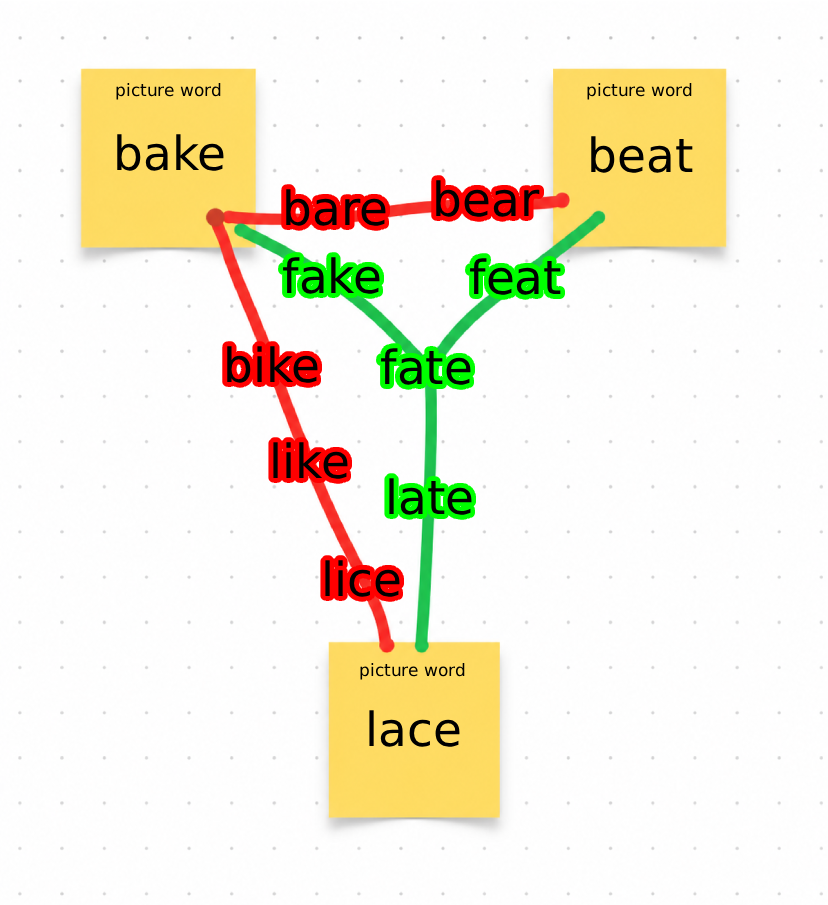

# Goal
This project tries to 'solve' the word game **wordward-draw** hosted at:

https://managore.itch.io/wordward-draw

Note that this project was mostly developped during the pre-AI era lol (circa 2023).

# Rules of the game

You start with a 4 letter word (in the game, we start with the words WORM -> WORD -> WARD)

You can move from one word to another if

* They only differ by 1 letter. eg: W[O]RD -> W[A]RD
* OR they are anagrams. eg: WARD -> DRAW

The list of valid 4 letter word is defined in `./dictionary.txt`.
The goal of the game is to reach 105 **picture words** (defined in `./all_picture_words.txt`)

My goal, and what I call *solving* is finding the shortest path possible to reach all the words. The game also allows your to **`undo`** your last operation, I consider those as free operations.

# Results

My current best score is 173 operations. The result can be seen in `./result.txt`.

```
WORM 0 
WORD 1
WARD 2 
DRAW 3
dram 4
DRUM 5
>dram 5
>>DRAW 5
dray 6
XRAY 7
>dray 7
>>DRAW 7
>>>WARD 7
CARD 8
caid 9
ACID 10
>caid 10
>>CARD 10
...
```
An uppercased word is part of the picture words.
The `>` angled brackets indicate an undo.

# Process

## Perspective shift

Instead of searching directly for the shortest path (the smallest number of operations), we look for the smallest **connected** set of words that contains all the picture words. Generating a path from that set is then easy: because **`undo`** is free, we can visit the entire set in exactly `(set size − 1)` operations, starting from DRAW (the first word where we control our next move).

Why is such assumption permissible? Think of the set as a tree rooted at DRAW. Reaching each new word costs one operation, and after reaching a word we can `undo` back toward the root for free — so returning to a branch point to explore a different direction costs nothing. Every word is therefore paid for exactly once, when we first reach it. The total number of operations equals the number of words we have to reach, so minimizing operations is the same as minimizing the size of the set.

The game states 105 picture words, but you'll notice I have 107 in `./all_picture_words`. That is because I have added `ward` and `word` to that list, since they are the game's starting words I should have them in my set of words anyway.

## A NP-hard problem

There's 3915 words in the dictionary. The most naive approach would be to create a set with all picture words, then recurcively tries to add words one by one in the set until every picture word is connected.
This takes too much time, it's not possible to find an optimal solution in a reasonable amount of time.

The problem is NP-hard. There's the [Kruskal Algorithm](https://en.wikipedia.org/wiki/Kruskal%27s_algorithm) which look like it could give us a solution. But it is actually trivial to find a counter-example:

Given a set of connected nodes, Kruskal Algorithm gives us the minimum spanning tree. But crucially, one assumption is that all the nodes are already connected. In our case, we have nodes we can connect to the tree or not (all the other non picture words).

Selecting such nodes can have advantages the Kruskal Algorithm cannot take advantages of.



Here's a trivial example with 3 Picture words, `bake`, `beat` and `lace`.

The Kruskal Algorithm would pick the red connection of `bake - bare - bear - beat`. Failing to realize that even if it's one more word, the green route `bake - fake - fate - feat - beat` will eventually save a word when trying to connect with `lace`

Red visited 7 unique words, green only hit 6.

What I do. Since the picture-word list is static, I first shrink the search space with optimality-preserving reductions — each keeps at least one optimal solution, so the reduced instance has the same optimum as the original. T

Only once no such reduction exist do I fall back on heuristics.

We start with 3915 words in our dictionnary. I manage to reduce it to 2283 before doing my heuristic search.

## Structure

global vars are:

**`KEYWORDS`**
**`dictionary`**
**`ALLSETS`**

**`dist_2_pinks`**

```python
class Set:
    def __init__(self, words: set[str], links: set[str]):
        self.isKey # is the set part of the solution?
        self.words # the words in it
        self.links # connections to other sets
```

Using the Set class, we create an undirected edge-weighted graph of all the words.
A Set is a group of words with at least one word.