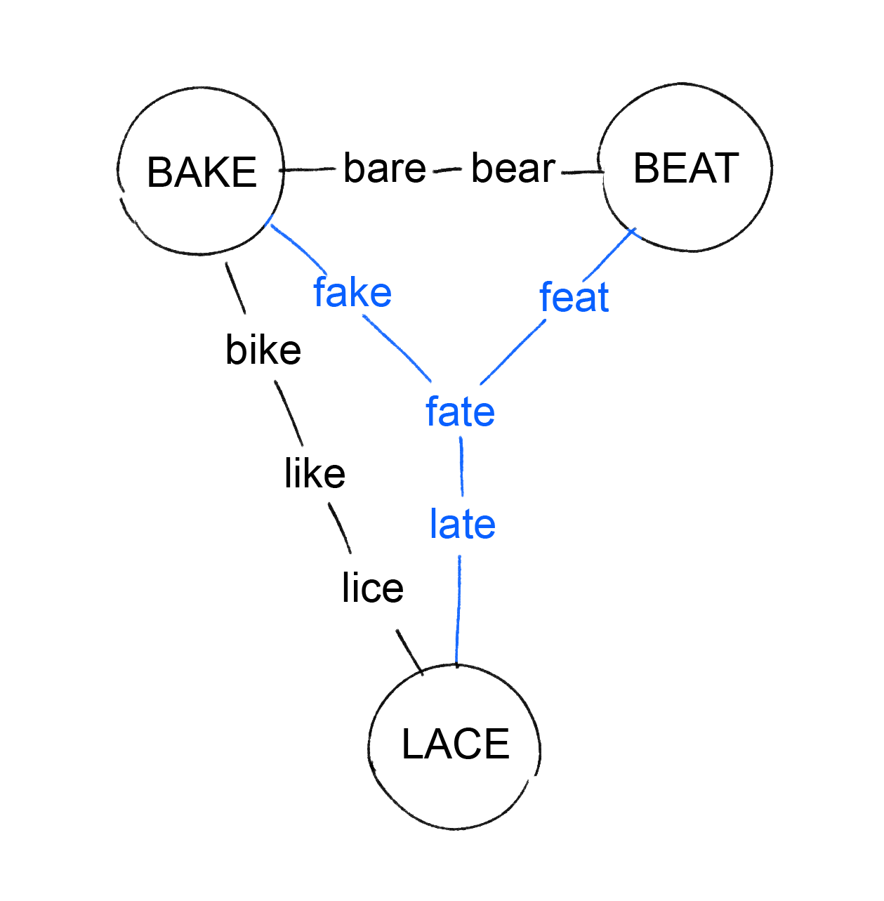

# Goal
This project tries to 'solve' the word game **wordward-draw** hosted at:

https://managore.itch.io/wordward-draw

Note that this project was mostly developped during the pre-AI era lol (circa 2023).

# Rules of the game

You start with a 4 letter word (in the game, we start with the words WORM -> WORD -> WARD)

You can move from one word to another if

* They only differ by 1 letter. eg: W[O]RD -> W[A]RD
* OR they are anagrams. eg: WARD -> DRAW

The list of valid 4 letter word is defined in `./dictionary.txt`.
The goal of the game is to reach 105 **picture words** (defined in `./all_picture_words.txt`)

My goal, and what I call *solving* is finding the shortest path possible to reach all the words. The game also allows your to **`undo`** your last operation, I consider those as free operations.

# Results

My current best score is 173 operations. The result can be seen in `results/result_playable.txt`.

```
WORM 0 
WORD 1
WARD 2 
DRAW 3
dram 4
DRUM 5
>dram 5
>>DRAW 5
dray 6
XRAY 7
>dray 7
>>DRAW 7
>>>WARD 7
CARD 8
caid 9
ACID 10
>caid 10
>>CARD 10
...
```
An uppercased word is part of the picture words.
The `>` angled brackets indicate an undo.

# Process

## Perspective shift

Instead of searching directly for the shortest path (the smallest number of operations), we look for the smallest **connected** set of words that contains all the picture words. Generating a path from that set is then easy: because **`undo`** is free, we can visit the entire set in exactly `(set size − 1)` operations, starting from DRAW (the first word where we control our next move).

Why is such assumption permissible? Think of the set as a tree rooted at DRAW. Reaching each new word costs one operation, and after reaching a word we can `undo` back toward the root for free — so returning to a branch point to explore a different direction costs nothing. Every word is therefore paid for exactly once, when we first reach it. The total number of operations equals the number of words we have to reach, so minimizing operations is the same as minimizing the size of the set.

The game states 105 picture words, but you'll notice I have 107 in `./all_picture_words`. That is because I have added `ward` and `word` to that list, since they are the game's starting words I should have them in my set of words anyway.

## A NP-hard problem

There's 3915 words in the dictionary. The most naive approach would be to create a set with all picture words, then recurcively tries to add words one by one in the set until every picture word is connected.
This takes too much time, it's not possible to find an optimal solution in a reasonable amount of time.

The problem is NP-hard. There's the [Kruskal Algorithm](https://en.wikipedia.org/wiki/Kruskal%27s_algorithm) which look like it could give us a solution. But it is actually trivial to find a counter-example:

Given a set of connected nodes, Kruskal Algorithm gives us the minimum spanning tree. But crucially, one assumption is that all the nodes are already connected. In our case, we have nodes we can connect to the tree or not (all the other non picture words).

Selecting such nodes can have advantages the Kruskal Algorithm cannot take advantages of.



Here's a trivial example with 3 Picture words, `bake`, `beat` and `lace`.

The Kruskal Algorithm would pick the red connection of `bake - bare - bear - beat`. Failing to realize that even if it's one more word, the green route `bake - fake - fate - feat - beat` will eventually save a word when trying to connect with `lace`

Red visited 7 unique words, green only hit 6.

What I do. Since the picture-word list is static, I first shrink the search space with optimality-preserving reductions — each keeps at least one optimal solution, so the reduced instance has the same optimum as the original. T

Only once no such reduction exist do I fall back on heuristics.

We start with 3915 words in our dictionnary. I manage to reduce it to 2283 before doing my heuristic search.

## Structure

The code (`src/`) is layered so each file has one job:

| module | holds |
|---|---|
| `common.py` | `Set`, `find_all_branches`, `KEYWORDS`, `dictionary` |
| `utils.py` | `load`, `save`, `log` |
| `graph.py` | the `WordGraph` class — the graph itself plus every operation on it |
| `reductions.py` | the optimality-preserving reductions, as functions taking a `WordGraph` |
| `solver.py` | the heuristic search and the `__main__` entry points |

A **`Set`** is a group of one or more words that are all mutually reachable "for free" (e.g. anagrams already merged in):

```python
class Set:
    isKey : bool      # is the set part of the solution? (PINK vs GREY)
    words : set[str]  # the words in it
    links : set[str]  # ids of the connected Sets
    cost()            # number of non-picture words in it
```

A **`WordGraph`** wraps the two pieces of state the whole solver revolves around:

```python
class WordGraph:
    sets : dict[str, Set]                        # every Set, keyed by Set.id()
    dist_to_pinks : dict[str, dict[str, int]]    # each Set's distance to every PINK it can reach
```

Each Set is either **PINK** (`isKey == True` — it already contains a picture word, or we have committed it to the solution) or **GREY** (optional — a stepping-stone we may or may not keep). The problem becomes: make every PINK set connected as cheaply as possible, where a GREY set only costs us if we decide to keep it. `dist_to_pinks[A]` is what both the reductions and the heuristic use to reason about how expensive a word is to wire in.

## Reducing the search space

Because the picture-word list never changes, I first apply **optimality-preserving** reductions: each one provably keeps at least one optimal solution, so the smaller instance has the exact same optimum as the original. They run to a fixpoint in `optimize_all()`, each pass feeding the next, until nothing more can be removed.

* **Merge adjacent PINKs** (`merge_pink_sets`) — two PINK sets that are neighbours will both be in the answer, so contracting them into one changes nothing.
* **Promote forced sets** (`find_necessary_sets`) — tentatively delete a GREY; if the game becomes unwinnable (some PINK can no longer be reached), that GREY was a cut point present in *every* solution, so promote it to PINK. A PINK with a single neighbour forces that neighbour the same way.
* **Contract GREY chains** (`merge_greys`) — a degree-2 GREY whose neighbour is also a degree-2 GREY: reaching one forces passing through the other, so merge them.
* **Drop dead & dominated GREYs** (`delete_equivalent_greys`) — a GREY with ≤1 connection is a dead end (it can never bridge two PINKs). And if GREY `B`'s neighbours are a subset of GREY `A`'s, then `A` dominates `B` — anything `B` could connect, `A` connects at least as cheaply — so `B` goes.
* **Drop distance-dominated GREYs** (`delete_equi_greys_dist_to_pinks`) — the same idea using `dist_to_pinks`: if `B` is at least as far from every PINK as `A` is, `B` can be discarded.
* **Drop off-path GREYs** (`delete_hard_greys`) — for every pair of PINKs, collect every Set lying on a shortest path between them; a GREY that never appears on any such path can't help and is removed. (This is the slow one — it is effectively all-pairs shortest paths.)

Starting from 3915 words, these bring the graph down to **2283** Sets (saved as `graph_optimal_2283.pickle`) without giving up a single optimal solution.

## When the reductions stall: the heuristic

Past 2283, no reduction fires, so `euristic()` has to *guess* which GREY to commit — and once committed, it re-runs every reduction on the now-smaller graph:

1. **Find the bottleneck.** `pink_cost_sort()` ranks the PINKs by how far, on average, they sit from the others; the current hardest-to-reach picture word is where a wrong choice costs the most, so we work on it first.
2. **Pick its best neighbour.** For each candidate Set adjacent to that PINK, score it by how many PINKs it sits *near*: `sum( max(0, 7 − d)³ for d in dist_to_pinks[candidate] )`, minus the candidate's own `cost()`. The cube heavily rewards a word that is close to several picture words at once (anything farther than 7 contributes nothing); the `− cost()` penalises one that would drag in many non-picture words.
3. **Commit and reduce.** Promote the winner to PINK, merge, and loop back through all the reductions.

Repeated, this closes the graph down to a single connected set. My best-tuned run reached **173 operations** (preserved in `graph_173.pickle`, and rendered as the annotated path in `results/result_playable.txt`).

## Persisting state with `pickle`

`pickle` is Python's built-in **serialization** library. `pickle.dump()` writes any in-memory object — a plain `dict`, or here a whole graph of custom `Set` instances together with their `.words` and `.links` — to a byte stream on disk, and `pickle.load()` rebuilds the exact same objects later, in a completely separate run of the program. It saves you from re-deriving state on every launch or hand-rolling your own file format: what you load back is indistinguishable from what you saved.

I lean on it because both the reductions and the search are slow. `graph` and `dist_to_pinks` are dumped to / loaded from `.pickle` files via the `save()` / `load()` helpers, so a run can be stopped and resumed and expensive intermediate states can be frozen and reused. The named snapshots (`graph_optimal_2283.pickle`, `graph_173.pickle`, …) are simply those dumps captured at notable milestones.

Two things to know: a pickle can only be loaded where its classes are importable (hence `from common import Set` before every `load`), and pickles are *not* safe to load from untrusted sources — loading one can execute arbitrary code.

## Running it yourself

No dependencies beyond **Python 3** (standard library only). The code lives in `src/` (see the module table under [Structure](#structure)), and commands are run from the repo root — the `.txt` inputs and `.pickle` checkpoints sit there, and `src/common.py` reads them relative to the working directory.

```bash
python3 src/solver.py
```

On start it loads `graph.pickle` + `dist_to_pinks.pickle`, runs the heuristic, logs each decision to `log.txt`, and saves the resulting set back to `graph.pickle`.

### Starting from the beginning (all 3915 words)

The shipped `.pickle` files are pre-computed checkpoints. To regenerate them from nothing but the raw dictionary, run:

```bash
python3 src/solver.py init
```

This starts from all **3915** words in `dictionary.txt`, turns each into a singleton `Set`, computes `dist_to_pinks`, then applies the optimality-preserving reductions until they reach a fixpoint — writing `graph.pickle` and `dist_to_pinks.pickle` when it finishes. This is the step that shrinks the instance from **3915 → 2283** Sets, the smaller search space the heuristic then works on. It takes about two minutes and reproduces the shipped milestone `graph_optimal_2283.pickle` exactly (2283 Sets, 76 PINKs). With those two files in place you can run the heuristic below.

> One subtlety: `optimize_all()` maintains `dist_to_pinks` only incrementally, so its stored distances drift (they stay too optimistic as Sets are deleted) and the distance-based prune stops early — a single reduction pass bottoms out around 2316 Sets. `build_from_scratch()` therefore **recomputes `dist_to_pinks` from scratch between rounds**, which unlocks the missed deletions and converges to 2283.

### Re-running the heuristic

The bundled `graph.pickle` is already a finished run, so as-is the script just re-reports that solution and exits immediately. To watch the search happen again, reset to the post-reduction checkpoint first (either the one `init` just produced, or the shipped milestone):

```bash
cp graph_optimal_2283.pickle graph.pickle
cp "dist_to_pinks_2283.pickle"  dist_to_pinks.pickle
python3 src/solver.py        # now "euristic: added ..." lines appear in log.txt
```

A full run is slow — the `delete_hard_greys` all-pairs pass dominates the time. Reaching the record 173 also involved hand-tuning the heuristic's weights and stop threshold, so a fresh run lands *near* — not necessarily on — 173; the record itself is preserved in `graph_173.pickle` / `results/result_playable.txt`.

### Rendering the solution (path or CSV)

A solved `graph` pickle stores the answer as a bare *set* of words. `src/render_solution.py` walks a spanning tree of that set — starting from the WORM → WORD → WARD → DRAW opening — and renders it in either of two formats. Run from the repo root:

```bash
# the playable move list: +1 per new word, free `>` undos
python3 src/render_solution.py "graph_173.pickle"                             # -> stdout
python3 src/render_solution.py "graph_173.pickle" results/result_playable.txt

# the spanning tree as a spreadsheet: word;isKeyWord;parent;children
python3 src/render_solution.py "graph_173.pickle" results/result_csv_view.csv  # inferred from .csv
python3 src/render_solution.py "graph_173.pickle" --csv                  # -> stdout
```

Because a spanning tree of *N* words has *N* − 1 edges, the move list is always exactly *N* − 1 operations. The generated files in `results/` are the human-readable twins of the `graph_173.pickle` checkpoint.