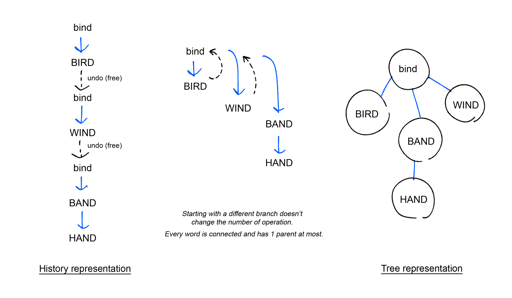
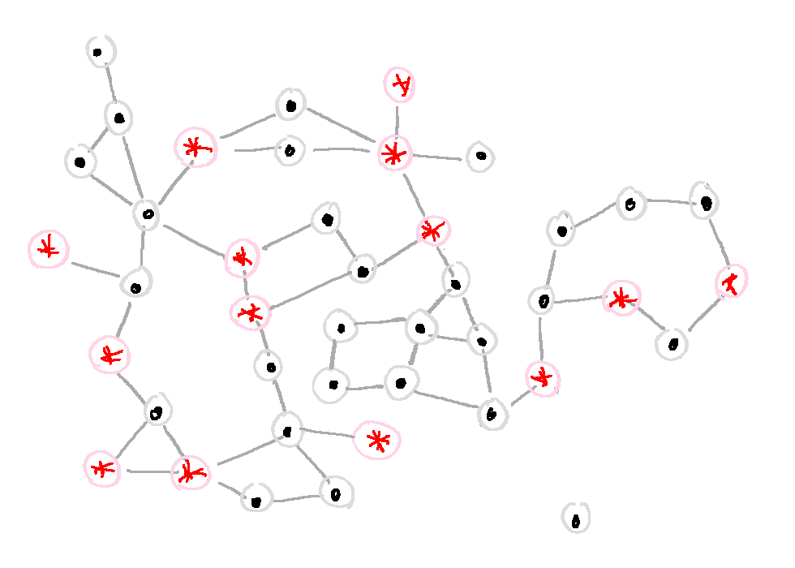
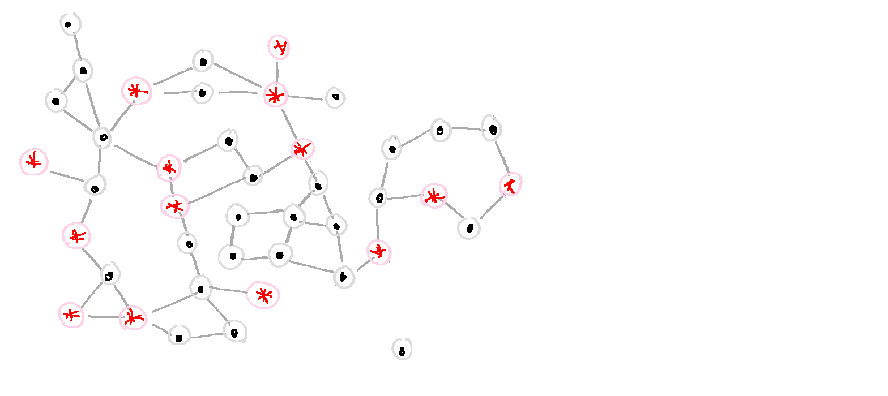
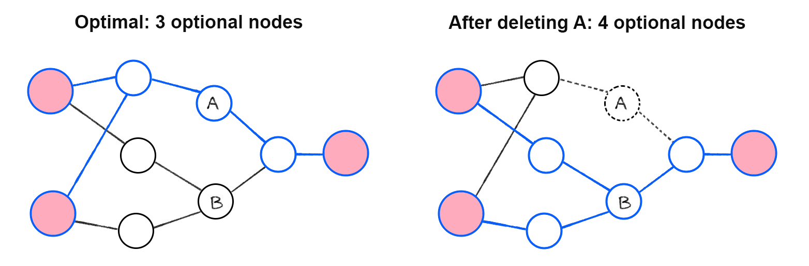

This project solves the word game **wordward-draw** (https://managore.itch.io/wordward-draw) in Python.

Originally written in 2023, it scored **173 operations**. Revisited with AI assistance in 2026: **171 operations**.

# The game

Start from a 4-letter word. You can move to another word if:

* They only differ by 1 letter. eg: W[O]RD -> W[A]RD
* OR they are anagrams. eg: WARD -> DRAW


The goal is to reach all 105 **picture words** (`all_picture_words.txt`); valid words are in `dictionary.txt` (3915).

*Solving* is finding the shortest path to reach every picture word. `undo`-ing an operation is free.

The game opens with WORM -> WORD -> WARD.

# The result

**171 operations**: [`results/result_playable_171.txt`](results/result_playable_171.txt).

```
WORM 0
WORD 1
WARD 2
DRAW 3
dram 4
DRUM 5
>dram 5
>>DRAW 5
dray 6
XRAY 7
...
```

* Uppercase = picture word
* `>` = undo
* right column = operation count.

# Paths to trees



Since `undo` is free, order doesn't matter — only the set of words does. **bind** → **BIRD** then undo then **bind** → **WIND** costs 2, same as a hypothetical path through both. So we can drop the undos and draw the solve as a tree rooted at **DRAW** (the first word we control). Operations in the history = edges in the tree.

We can rephrase our problem: **find the smallest tree spanning every picture word.**

`all_picture_words.txt` holds 107 words, not 105: `ward` and `word` are included since the game's opening puts them in the tree anyway.

# Complexity

There are 3915 words in the dictionary. The most naive approach would be to create a set with all picture words, then recursively test every combination of words until the set is connected. This is a very slow approach to find any solution.

Can't we use [Kruskal's Algorithm](https://en.wikipedia.org/wiki/Kruskal%27s_algorithm)?

Given a set of connected nodes, we can get the minimum spanning tree. But this assumes every node is already in the tree. Here we *choose* which non-picture words to include.


A counter-example:

Given the 3 picture words `BAKE`, `BEAT` and `LACE`. Kruskal's algorithm would pick the shorter black connection `BAKE` `- bare - bear -` `BEAT`, failing to realize that even if the blue route `BAKE` `- fake - fate - feat -` `BEAT` is one word longer, it will eventually save a word when connecting to `LACE`.

Black: 8 words, Blue: 7 words. We can't rely on Kruskal's Algorithm.

# Code structure

A **`Set`** groups words together.

```python
class Set:
    isKey : bool      # is the set part of the solution?
    words : set[str]  # the words in it
    links : set[str]  # ids of the connected Sets
    cost()            # number of non-picture words in it
    id() : str        # alphabetically first word in the Set
```

```python
class WordGraph:
    sets : dict[str, Set]                        # every Set, keyed by Set.id()
    dist_to_pinks : dict[str, dict[str, int]]    # each Set's distance to every PINK it can reach
```

<!-- | module | holds |
|---|---|
| [`word_set.py`](src/word_set.py) | `Set`, plus `KEYWORDS` / `dictionary` loaded from the `.txt` files |
| [`utils.py`](src/utils.py) | `load` / `save` (pickle), `log`, word moves (`find_all_branches`) |
| [`wordgraph.py`](src/wordgraph.py) | `WordGraph` and every operation on it |
| [`reductions.py`](src/reductions.py) | the reductions, as functions taking a `WordGraph` |
| [`solver.py`](src/solver.py) | the heuristic search and `__main__` entry points |
| [`render_solution.py`](src/render_solution.py) | solved pickle -> playable move list or CSV tree | -->

`WordGraph.from_dictionary()` turns every word into a singleton Set: **PINK** if it's a picture word or committed to the solution, **GREY** otherwise. The problem becomes: connect every PINK as cheaply as possible; a GREY costs only if kept.
Giving a graph like:



### Pickles

`pickle` is Python's built-in **serialization** library. I used it to save graphs I was working on.

| pickle | what it holds |
|---|---|
| `graph_full_3915.pickle` | all 3915 words as singleton Sets, no reductions (107 PINKs, 22,916 edges) |
| `graph.pickle` | the pickle the heuristic will load |

# Reductions

Most of the 3915 words won't be in the solution. Each reduction below is *optimality-preserving* — it keeps at least one optimal solution. `optimize_all()` loops them until nothing fires.

<!-- * **Drop dead GREYs** (`delete_dead_greys`) — no links or single-link GREYs (dead ends).
* **Merge adjacent PINKs** (`merge_pink_sets`) — two PINK neighbours can be merged together. The solver is done when 1 PINK remains.
* **Merge GREY chains** (`merge_greys`) — GREY `A` linked {B, C} and GREY `B` linked {A, D}: passing through one means passing through the other, so we can merge.
* **Promote forced sets** (`find_necessary_sets`) — tentatively delete a GREY; if some PINK becomes unreachable, that GREY is in every solution, so promote it. A PINK with one neighbour forces it too.
* **Drop dominated GREYs** (`delete_dominated_greys`) — if `B`'s neighbours ⊆ `A`'s *and* `A` costs no more, `A` connects anything `B` could for no extra words, so drop `B`.
* **Drop distance-dominated GREYs** (`delete_equi_greys_dist_to_pinks`) — if `B` is at least as far from every PINK as `A` and `A` costs no more, drop `B`. **This one is wrong**, see [below](#the-reduction-i-got-wrong). -->



3915 -> **2738** Sets.

# The heuristic

Past that point nothing fires, so `heuristic()` commits a GREY by guess, then re-runs the reductions.

1. **Find the bottleneck.** `pink_cost_sort()` ranks PINKs by average distance to the others; the hardest to reach is where a wrong choice costs most.
2. **Pick its best neighbour.** Score each adjacent GREY `sum( max(0, 7 − d)³ for d in dist_to_pinks[candidate] ) - cost()`. The cube rewards sitting near several picture words at once; `- cost()` penalises dragging in non-picture words. Parameter chosen empirically.
3. **Commit and reduce.** Promote the winner to PINK, loop.

Loads `graph.pickle` + `dist_to_pinks.pickle`, runs the heuristic, logs to `log.txt`, saves back to `graph.pickle`.

# Running it

### From scratch

Python 3, stdlib only.

```bash
python3 src/solver.py init
```

Rebuilds from `dictionary.txt`, computes `dist_to_pinks`, reduces to a fixpoint, writes both pickles. Stops before the heuristic.
It takes around 3 minutes.

### Running the heuristic

After having created a graph.pickle from the previous step:

```bash
python3 src/solver.py
```

Note that there is some randomness involved as ties can happen, to get the exact result [`results/result_playable_171.txt`](results/result_playable_171.txt), run:

```bash
PYTHONHASHSEED=2 python3 src/solver.py     # 172 words, 171 operations
```

This will update the graph.pickle. It takes around 12 minutes.

### Readable solution

```bash
# playable move list: +1 per new word, free `>` undos
python3 src/render_solution.py "graph_173.pickle"                                 # -> stdout
python3 src/render_solution.py "graph_173.pickle" results/result_playable_173.txt

# spanning tree as a spreadsheet: word;isKeyWord;parent;children
python3 src/render_solution.py "graph_173.pickle" results/result_csv_view.csv     # inferred from .csv
python3 src/render_solution.py "graph_173.pickle" --csv                           # -> stdout
```

# Appendix: AI improvements (2026)

Came back to this with Claude, to check the solution and clean up the code.

The problem has a name: the **[node-weighted Steiner tree problem](https://en.wikipedia.org/wiki/Steiner_tree_problem)**. PINKs are terminals (weight 0, mandatory), GREYs are Steiner nodes (optional, weight = how many non-picture words they hold). My reductions turn out to be textbook — except one, which is wrong.

It tried other approaches, but the most effective one was still reusing my heuristic. The AI could test different seedings and parameters. The loss function was changed from `max(0, 7 − d)³` to `max(0, 4 − d)³`. Result: **171 operations**, two better than 2023.

### The reduction I got wrong



**Drop distance dominated Greys** can remove an optimal solution: node A has the same PINK distances as B and could get dropped.
